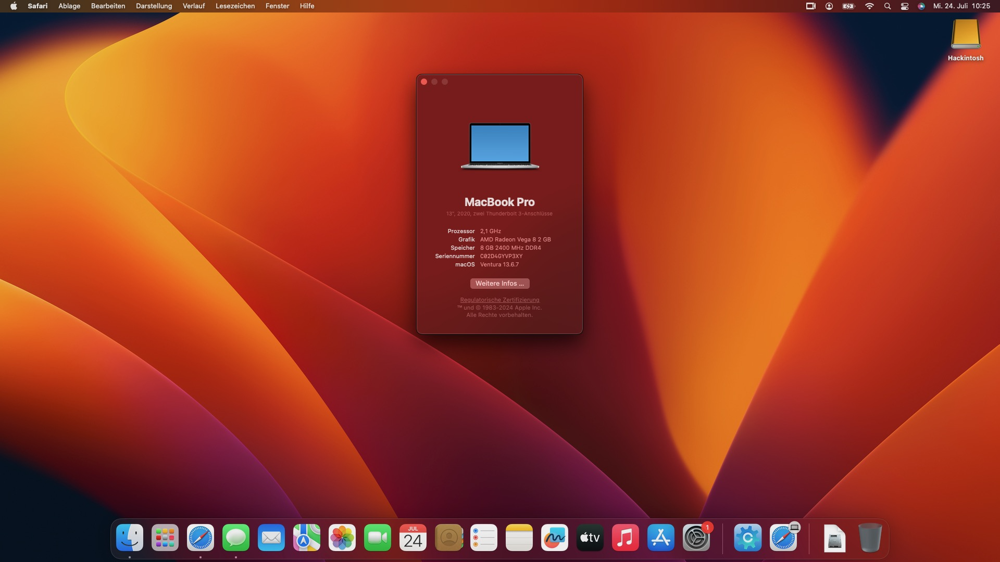

# Thinkpad-T495-Hackintosh

## Disclaimer

Use at your own risk. I take no responsiblity if your rig explodes. Create unique SMBios values for your rig. Copy the [config.example.plist](EFI/OC/config.example.plist), change the name in config.plist and replace the "REPLACEME" values

## Status

* Ventura is working without Issues
* Sonoma has some gravere [Issues](<https://github.com/ChefKissInc/NootedRed/issues/235>)

## Specification

| Component        | Model                                      |
| ---------------- | -------------------------------------------|
| Laptop           | Thinkpad T495                              |
| CPU              | AMD Ryzen 5 3500                           |
| Wifi/Bluetooth   | Intel Wireless AC 9260                     |
| OS Disk          | ~~Samsung 256GB NVME~~ WD Blue 500GB NVME  |
| RAM              | 16GB (8GB soldered + 8GB in slot)          |
| GPU              | AMD Radeon Vega 8 (VRAM 2GB)               |

## What is working

* Graphics
* Wifi works
* Bluetooth
* Trackpad with gestures
* Brightness control
* Battery Status
* Keyboard (Not mapped to Apple Keyboard but as an external one)
* Ethernet Port
* Internal Sound with JACK (ALC257, layout-id=11)
* HDMI output (Not tested)
* Microphone (Not tested)
* FileValut encription support (encouraged)

## What will never be working?

* Fingerprint Sensor

## Recommended BIOS settings

* Secure boot --> Off
* Memory Protection --> Off
* TPM 2.0 --> Disabled
* Hyperthreading --> on
* Anything security related --> off
* Display --> set to 2GB minimum
